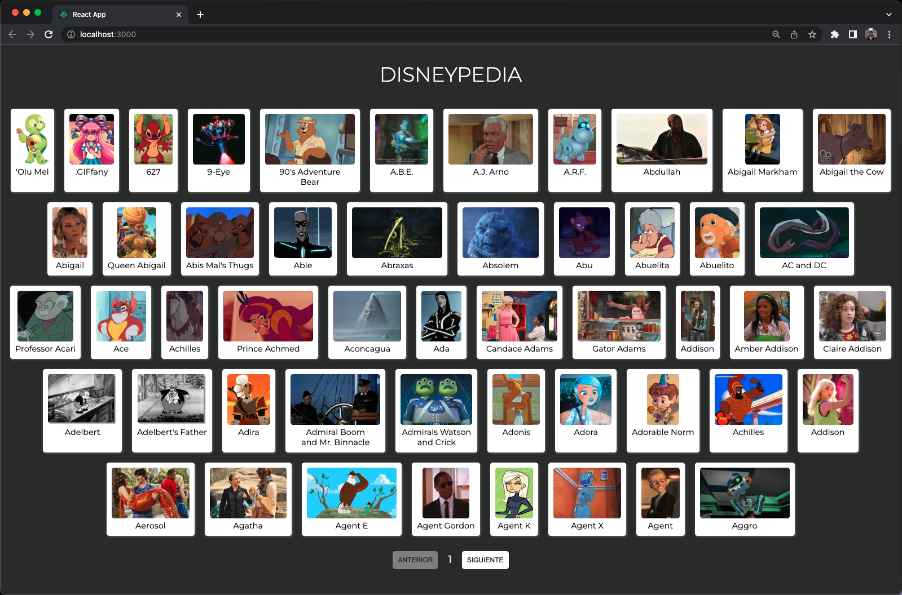
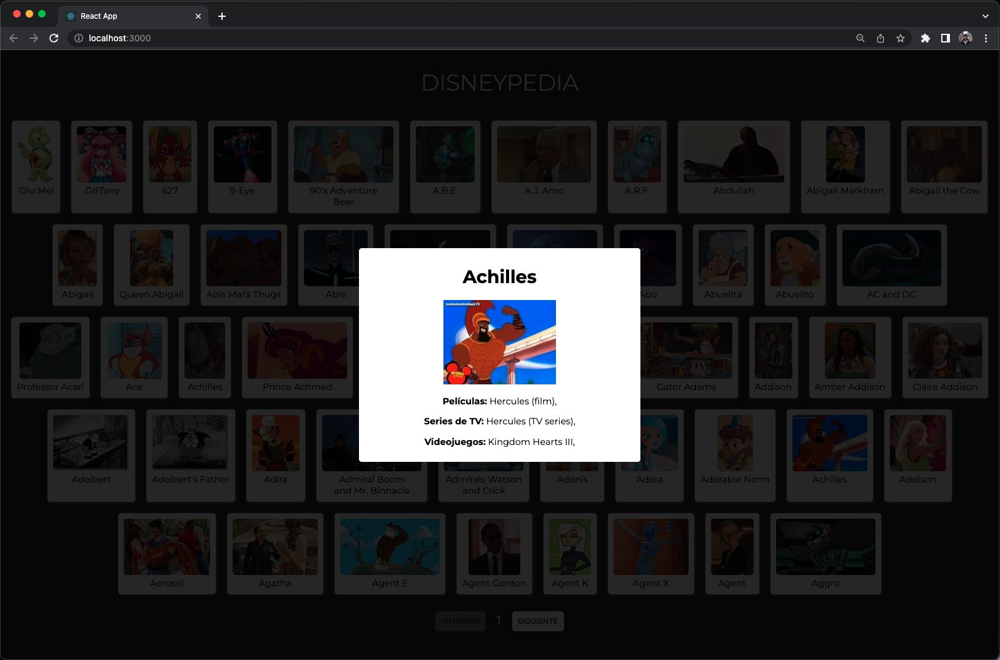
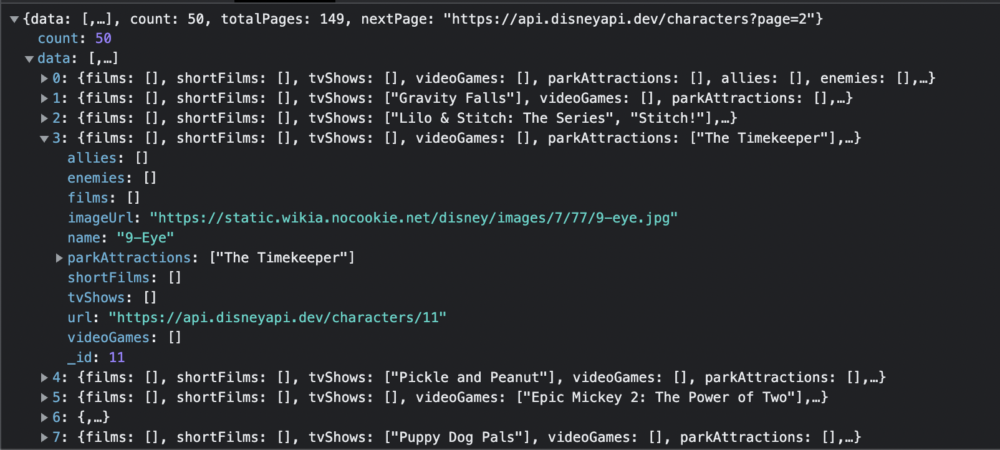
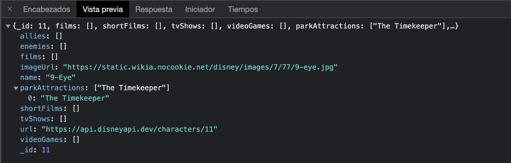

# WORKSHOP 2: DisneyPedia

Disney nos ha encargado realizar una enciclopedia con la información de sus personajes, para ello nos han entregado una API REST que podemos consumir para consultar toda la información.

¡Debemos prestar un poco de atención al diseño ya que Disney quiere presentar la web por todo lo alto!

La web mostrará todos los personajes de Disney paginados, de manera que podamos movernos por las páginas pulsando los botones de anterior y siguiente. Para cada personaje de Disney mostraremos una tarjeta con el nombre y la foto.

Como una imagen vale más que mil palabras, así quedaría la home de la DisneyPedia:

Cuando el usuario pulse sobre la tarjeta de uno de los personajes se deberá levantar una ventana con forma de modal, que mostrará los siguientes datos en caso de que los tengamos disponibles a través del API:

- Nombre del Personaje
- Foto
- Aliados
- Enemigos
- Películas
- Atracciones
- Cortos
- Series de TV
- Videojuegos

Verás que algunos personajes tienen más datos que otros, recuerda solo mostrar el listado de aquellos datos que vengan de la API. Un ejemplo de personaje con datos de películas, series de TV y Videojuegos sería Achilles, que se vería de la siguiente manera:

Por otro lado, un personaje con pocos datos es Adonis, que solo aparece en una serie de TV:

Para cerrar la ventana modal bastará con hacer click en la propia modal o en el fondo negro que se muestra detrás.

## Detalles de la API

Para recuperar el listado de personajes de Disney debemos hacer uso de la siguiente API:

<https://api.disneyapi.dev/characters?page=1>

Como podrás observar la API recibe un parámetro con la página que deseas consultar, y te devolverá siempre 50 personajes. En la siguiente captura podrás ver la respuesta de la API con un personaje desplegado:

Para recuperar el resto de página solo tendríamos que ir llamando con el número de página deseado:

<https://api.disneyapi.dev/characters?page=2>

<https://api.disneyapi.dev/characters?page=3>

…

etc

De esta petición solo utilizaremos:

- Nombre del personaje (name)
- Imagen (imageUrl)
- ID (\_id)

Cuando el usuario pulse sobre una tarjeta, haremos una nueva petición para recuperar todos los detalles del personaje haciendo uso de una petición específica para ello:

<https://api.disneyapi.dev/characters/11>

Esta petición recibe el ID del personaje (en el ejemplo anterior 11) y te devolverá todos los detalles:

Es cierto que estos mismos datos ya los teníamos disponibles en la petición anterior, pero debemos consumir este API para trabajar casos más parecidos a la realidad, ya que habitualmente en la petición del listado no disponemos de todos los datos y es muy habitual tener que llamar a una petición de detalle específica.

## Otros requisitos técnicos

Cada vez que se haga una llamada se debe mostrar un mensaje “Cargando…”, esto aplica tanto para el paginado como para la consulta de un detalle.

Si tu internet es muy rápido y no consigues ver el mensaje recuerda que puedes simular una red lenta desde las opciones de desarrollador de Chrome → Red → 3G Lento

Recuerda también componetizar tu aplicación, deberás al menos crear los siguientes componentes:

- Listado de personajes
- Tarjeta Personaje
- Detalle de un personaje
- Cargando

El botón de anterior deberá estar deshabilitado cuando estemos en la primera página (1) y lo mismo con el botón de siguiente cuando estemos en la última (para saber cuántas páginas hay deberás mirar la respuesta de la API a la llamada del listado).

Recuerda también hacer uso de todo lo aprendido esta semana:

- Props
- Callbacks
- UseEffect
- UseState
- Debounce
- Llamadas a APIs con Fetch
